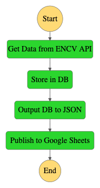

# COVID-19 Exposure Notification Apps - Metrics Aggregation Tools
_Contributors: Nat Hillard, Steve Leibman, Chris Pimlott, Thad Batt, Michelle Park, Janell Schafer, Kelly Taylor_

## Background
This repository was created by the Colorado Digital Service to automatically consolidate analytics for the Exposure Notifications system. [Exposure Notifications](https://www.google.com/covid19/exposurenotifications/) is a service created by Apple and Google to notify people who may have been exposed to someone who tested positive for COVID-19. To inform and improve the service, this repository provides a general purpose framework for states and other organizations to automatically fetch Exposure Notifications metrics for their jurisdiction across a set of data sources, aggregate these metrics into a single database, and write consolidated metrics into a viewable Google sheet. Please note that we are currently not accepting pull requests.

## Overview
The code here is written in python, and makes use of [AWS Step Functions](https://aws.amazon.com/step-functions/) to orchestrate work on a scheduled basis with predefined triggers and dependencies.
It was initially designed to pull data from the following sources:
* An API for an Association of Public Health Laboratories (APHL) key server, with statistics for the number of Exposure Notification (EN) App "codes issued"
 and "codes claimed".
* A Google Cloud storage bucket with information from Google Play on Android EN App adoption
* A Google Cloud storage bucket with information on iOS adoption of EN functionality

After applying filters and transformations, the initial implementation pushed results to:
* A centralized Google BigQuery database, and
* A Google Sheets spreadsheet

In the actual deployment for the initial use case, the approach was updated to bypass this toolset for a subset of the above sources and destinations, in cases where native tools were available.
The steps moving from Google Cloud Storage to BigQuery can be accomplished using BigQuery's [Data Transfers](https://console.cloud.google.com/bigquery/transfers) feature, and the act of pulling data from BigQuery to Google Sheets can be done using Google Sheets [Data Connectors](https://support.google.com/docs/answer/9702507?hl=en) (note that this feature is only available for Sheets users inside a GSuite organization, and only if the org has the tool enabled).
As of mid-April, 2021, The initial users continue to use the code provided in this repository for the task of pulling from third party APIs and pushing to BigQuery.


The application is structured as a collection of smaller functions that can be invoked as independent standalone steps (for development and testing) or orchestrated as an AWS Step Functions State Machine, using AWS SAM. 

Current steps consist of the following:




## APHL / ENCV API

This code uses the Google-provided Exposure Notifications Verification Server `stats` API (documented [here](https://github.com/google/exposure-notifications-verification-server/blob/main/docs/api.md#apistats-preview)) to retrieve statistics about issued and claimed codes.

It currently uses the `realm` statistics, defined above as:
`Daily statistics for the realm, including codes issued, codes claimed, and daily active users (if enabled).`


## Prerequisites


1. Install `pip` if you have not already:
   ```sh
   curl https://bootstrap.pypa.io/get-pip.py -o get-pip.py
   python get-pip.py
   ```
2. Install the AWS SAM CLI using the instructions at https://docs.aws.amazon.com/serverless-application-model/latest/developerguide/serverless-sam-cli-install.html On Mac OSX if you already have Homebrew, this would be:
   ```sh
   brew tap aws/tap
   brew install aws-sam-cli
   ```
   Otherwise:
   ```sh
   wget https://github.com/aws/aws-sam-cli/releases/latest/download/aws-sam-cli-linux-x86_64.zip
   unzip aws-sam-cli-linux-x86_64.zip -d sam-installation
   sudo ./sam-installation/install
   sam --version
   ```
3. Install Poetry using the instructions at https://python-poetry.org/docs/ . On Mac OSX, this will be:
   ```sh
   curl -sSL https://raw.githubusercontent.com/python-poetry/poetry/master/get-poetry.py | python -
   source $HOME/.poetry/env
   ```
   Otherwise:
   ```sh
   pip3 install poetry
   ```
4. Install Docker. See: https://docs.docker.com/get-docker/
   ```sh
   sudo yum update -y
   sudo amazon-linux-extras install docker
   sudo service docker start
   sudo usermod -a -G docker ec2-user
   docker ps
   ```
5. Build requirements files and containers:
   ```sh
   cd <directory_with_this_README>
   make
   ``` 


## Build, Test, Usage, Deployment

Instructions for building the software, testing locally, doing interactive local runs, and deploying to production can be found in [functions/README.md](functions/README.md)


## Configuration

1. Either obtain an existing API key for pulling data from the APHL server at encv.org, or create a new API key on the encv site [here](https://encv.org/realm/apikeys):
   - `User Menu -> API keys -> plus`
   - Select type `Stats (can view statistics)` Note: Admin type keys are not able to pull stats.
   
1. You'll need a file named `.env` with the following variables set, or an environment that has them set, at the top level of this directory:

   ```sh
   ENCV_API_KEY=xxxxxxxxxxx
   LOGLEVEL=xxxxxxxxxxx
   ```
   * `ENCV_API_KEY`: The API key for encv.org
   * `LOGLEVEL`: [optional] one of `ERROR`, `INFO`, or `DEBUG` (default is `INFO`)
   
1. Additionally, for the tests that update google sheets, you can add a file named `.env` in the `<top_level>/functions/json_to_sheets/tests` directory with the variable `EXTRA_USER` set.
   This can be necessary if debugging sheets-related tests, because by default sheets created by a service account are not visible to other accounts.
   If you set `EXTRA_USER`, this user will also be granted read permissons and can view the sheet created by the test by going to https://drive.google.com/drive/u/0/shared-with-me .

1. A file named `service.json` needs to be saved as `<top_level>/functions/json_to_sheets/service.json`. This should contain the credentials for the service account associated with the drive/sheets API, and can downloaded from the Google console by: 1. Getting added as an `owner` to the associated Google Developer Console project. 2. going to IAM Admin in the Google console here: https://console.developers.google.com/iam-admin/serviceaccounts , then selecting your project, and going to `“…” -> “Create key”`, or by using an already-generated key (you can only generate a given key once).


### Gotchas

1. Rate limiting
   We've seen the permission-setting portion of the test code cause issues with rate limiting. If you get a message like the following:

   ```sh
   googleapiclient.errors.HttpError: <HttpError 403 when requesting https://www.googleapis.com/drive/v3/files/xxx/permissions?alt=json returned "Rate limit exceeded. User message: "Sorry, you have exceeded your sharing quota."". Details: "Rate limit exceeded. User message: "Sorry, you have exceeded your sharing quota."">
   ```

   You can remove the `EXTRA_USER` entry from `tests/.env` and the tests should run without trying to set permissions.

2. Date Formats
   The date format on your target sheet may trip up the tests. If you run into problems, double check `source_date_format` and `destination_date_format` and make sure they match expectations.
